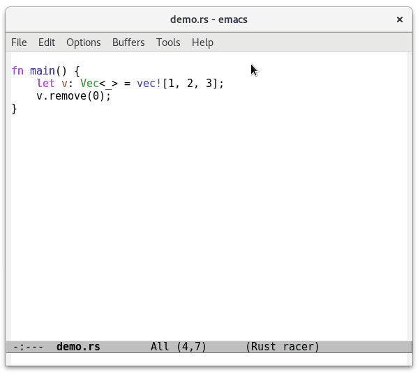
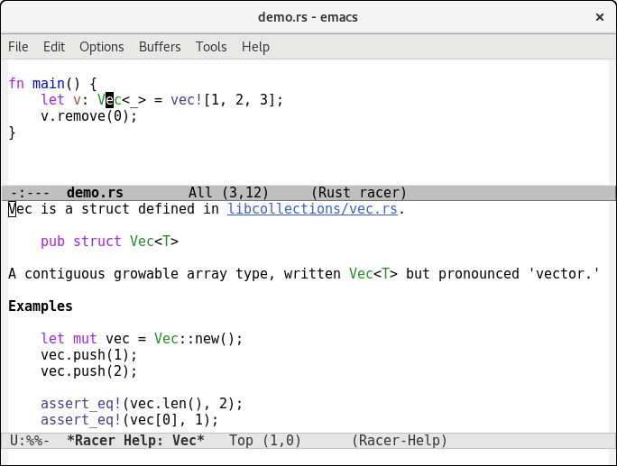

# Racer for Emacs
[](http://melpa.org/#/racer)
[](http://stable.melpa.org/#/racer)
[](https://coveralls.io/github/racer-rust/emacs-racer?branch=master)

This is the official Emacs package for
[Racer](http://github.com/phildawes/racer).

<!-- markdown-toc start - Don't edit this section. Run M-x markdown-toc-generate-toc again -->
**Table of Contents**

- [Racer for Emacs](#racer-for-emacs)
    - [Completion](#completion)
    - [Find Definitions](#find-definitions)
    - [Describe Functions and Types](#describe-functions-and-types)
    - [Installation](#installation)
        - [Testing your setup](#testing-your-setup)
    - [Tests](#tests)

<!-- markdown-toc end -->

## Completion

racer.el supports code completion of variables, functions and modules.


You can also press <kbd>F1</kbd> to pop up a help buffer for the current
completion candidate.

Note that due to a
[limitation of racer](https://github.com/phildawes/racer/issues/389),
racer.el cannot offer completion for macros.

## Find Definitions

racer.el can jump to definition of functions and types.



You can use <kbd>M-.</kbd> to go to the definition, and <kbd>M-,</kbd>
to go back.

## Describe Functions and Types

racer.el can show a help buffer based on the docstring of the thing at
point.



Use <kbd>M-x racer-describe</kbd> to open the help buffer.

## Installation

1. You will need to use a nightly version of rust.
   If you're using rustup, run
   ```
   $ rustup toolchain add nightly
   ```

2. Install [Racer](http://github.com/phildawes/racer) and download the
   source code of Rust:

   ```
   $ rustup component add rust-src
   $ cargo +nightly install racer
   ```

3. Allow Emacs to install packages from MELPA:

   ```el
   (require 'package)
   (add-to-list 'package-archives '("melpa" . "https://melpa.org/packages/"))
   ```

4. Install the Emacs package for Racer: `M-x package-install RET racer RET`

5. Configure Emacs to activate racer when rust-mode starts:
   ```el
   (add-hook 'rust-mode-hook #'racer-mode)
   (add-hook 'racer-mode-hook #'eldoc-mode)
   ```

   For completions, install company with `M-x package-install RET company RET`. A sample configuration:
   ```el

   (add-hook 'racer-mode-hook #'company-mode)

   (require 'rust-mode)
   (define-key rust-mode-map (kbd "TAB") #'company-indent-or-complete-common)
   (setq company-tooltip-align-annotations t)
   ```
   For automatic completions, customize `company-idle-delay` and
   `company-minimum-prefix-length`.

   Racer process may be slow to respond for instance when indexing. You can
   customize `racer-command-timeout` and `racer-eldoc-timeout` to avoid rendering
   your Emacs session unresponsive. Eldoc timeout should be on the lower side and
   defaults to 0.5 seconds. You can probably tweak it down on a fast machine.
   Timeout of `nil` will wait indefinitely.

### Testing your setup

To test **completion**: Open a rust file and try typing ```use
std::io::B``` and press <kbd>TAB</kbd>.

To test **go to definition**: Place your cursor over a symbol and press
`M-.` to jump to its definition.

Press `C-x 4 .` to jump to its definition in another window.

Press `C-x 5 .` to jump to its definition in another frame.

Press `M-,` to jump back to the previous cursor location.


If **it doesn't work**, try `M-x racer-debug` to see what command was
run and what output was returned.

## Tests

racer.el includes tests. To run them, you need to install
[Cask](https://github.com/cask/cask), then:

```
$ cask install
$ cask exec ert-runner
```
